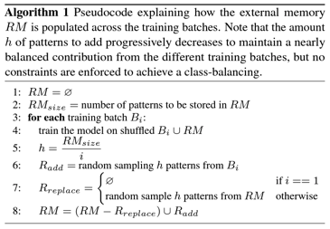

# Comparison between CL strategies and SML models on MIMI dataset

Optional project of the [Streaming Data Analytics](http://emanueledellavalle.org/teaching/streaming-data-analytics-2022-23/) course provided by [Politecnico di Milano](https://www11.ceda.polimi.it/schedaincarico/schedaincarico/controller/scheda_pubblica/SchedaPublic.do?&evn_default=evento&c_classe=811164&polij_device_category=DESKTOP&__pj0=0&__pj1=1b82965d3c68857e2087d3f3b98a9e40).

Student: **Erika Buoninfante**

MIMI dataset ([Link 1](https://zenodo.org/record/3384388#.ZBRSFOzMJhF), [Link 2](https://dcase.community/documents/workshop2019/proceedings/DCASE2019Workshop_Purohit_21.pdf)) is a sound dataset for malfunctioning industrial machine investigation and inspection of three types of machines (pumps, valves, and fans).
Each type of machine includes four individual product models, and the data for each model contains normal sounds (from 5000 seconds to 10000 seconds) and anomalous sounds (about 1000 seconds).
Various anomalous sounds were recorded to resemble a real-life scenario (e.g., contamination, leakage, rotating imbalance, and rail damage).
We will provide you with the pre-processed dataset in which we have divided each 10-second sound segment into 2-second segments using a sliding window. All the sound segments have been converted into real vectors.

Using this dataset, you must resolve the fans’ predictive maintenance problem from a Continual Learning perspective. We want a model to classify the sound as normal or anomalous correctly. You can imagine splitting the problem into four sub-problems, one for each specific fan. You don't have all the data available initially, but the different sub-problems are provided over time. The goal is to develop a model able to learn continually one sub-problem (task) at a time and not forget the old learned ones. The final model must be able to resolve all four tasks effectively.

The project uses CL evaluation procedures to compare CL strategies and SML models in an Incremental Task Learning scenario. 

The following CL strategies will be of interest:
- Baseline strategies: Naive Strategy and Cumulative Training (or Rehearsal).
During the i-th experience's training, Cumulative Training trains the model on all the experiences from the first to the i-th. Please remember to shuffle the training data before starting each experience’s training.
- Replay strategies: Random Replay:
It uses a fixed-size Random Memory (RM) to store a subset of random previous experiences' data points. During the training on the i-th experience, it trains the model on the i-th training set shuffled with a fixed-size Random Memory (RM). RM contains a random subset of the data points of the previous experiences' training sets. After the training, it randomly substitutes some data points with a random subset of the current experience's training set in RM. This way, RM will be updated for the next experience and maintain an approximately equal number of examples for each experience.
The algorithm is detailed as follows.\

- Regularization strategies: Elastic Weight Consolidation (EWC).

To implement the different strategies, you can take the code in "intro_to_CL.ipynb" we saw together during the class. 
You can use a Feed-Forward Neural Network and a Convolutional Neural Network (with 1D convolutions) as the base models for all the strategies. 
Since we are not interested in the best model configuration, keep the model simple, use a low number a layers and do not focus too much on the hyperparameter tuning.
Please keep the epochs number low (maximum 2 o 3).

Use two different RM size: 20% and 30% of the smaller training set.

Regarding the SML models, you must use at least the following ones:
- Adaptive Random Forest
- Hoeffding Adaptive Tree

The idea is to train the SML models continuously, experience by experience, one data point at a time. Imagine the MIMI dataset as a stream that generates the different data points from the first experience to the last. The SML models must be able to detect the drifts after the experiences autonomously. Please be aware that to train the SML models you can use only the data points of each experience's training set. You can use the default parameters of the River library to instantiate the models.

The comparison must include the following metrics:
- Average accuracy. 
- A metric. 
- Forward Transfer Metric. 
- Backward Transfer metric.

The project must also include plots and reasoning on plasticity, stability, and Forward and Backward Transfer, as seen during the SDA course. Please note that to calculate the metrics and implement the plots, you must compute the accuracy after each experience's training on all the experiences' test sets (for both CL strategies and SML models).

Analyze a third case in which the SML models, for each task, can use the entire experience to learn continuously (including both training and test sets). For the performance evaluation, after each experience's training, you must evaluate the performance on the current test set using the prequential evaluation: on each data point of the test set, first test and then train. Then, you must only perform the test phase without training on the other experiences. Please be aware that, in this case, we are using the test set of the previous experiences on which we have previously trained the model. Despite this, it could still be helpful to analyze the stability of the SML models.

You can perform random undersampling of the majority class for each task, resulting in a 60%-40% balance between the two classes. It is recommended to use an 80%-20% split for the training and test sets. 
You are required to create a single ipynb file. You must include comments for the principal instructions, and you are allowed to import external py modules. Additionally, ensure you thoroughly comment on the comparison results using various plots associated with the different metrics. Finally, briefly discuss the conclusions that can be drawn from the experiment.
Please also add a requirements.txt file with the instructions to execute the notebook and the required packages.
